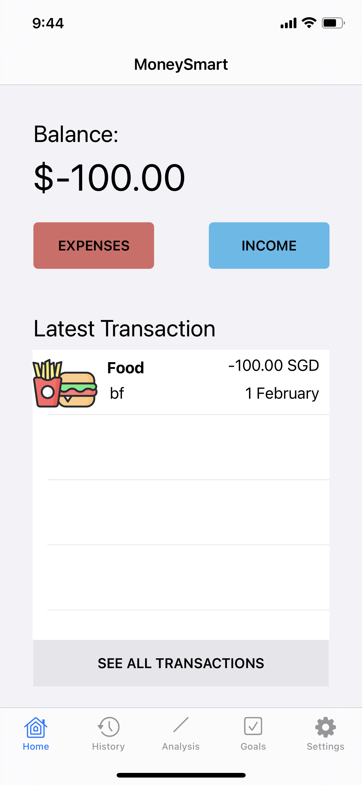
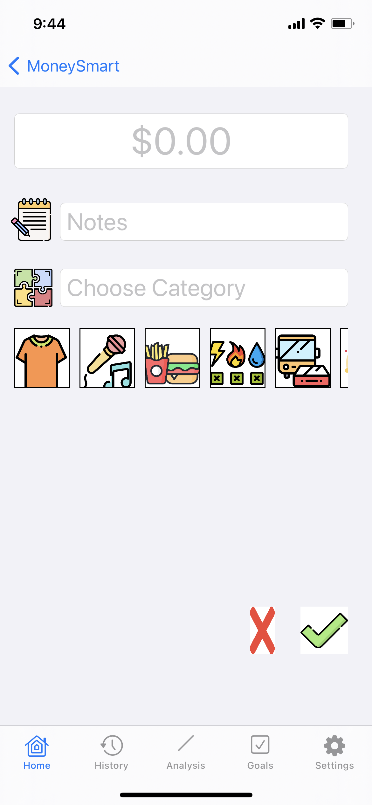
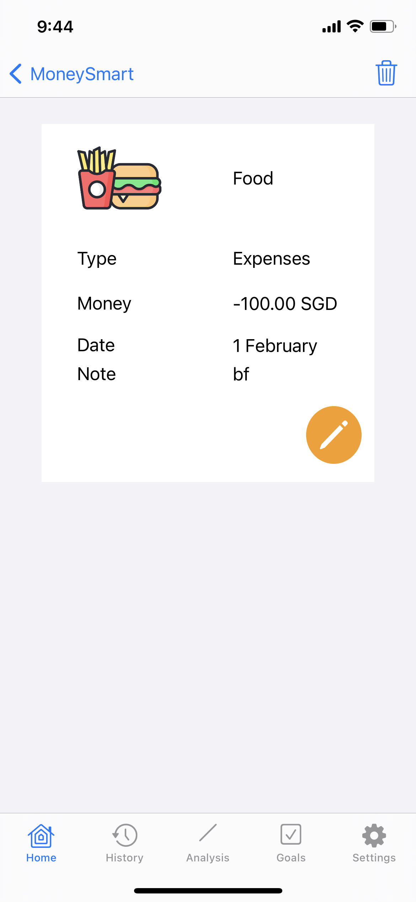
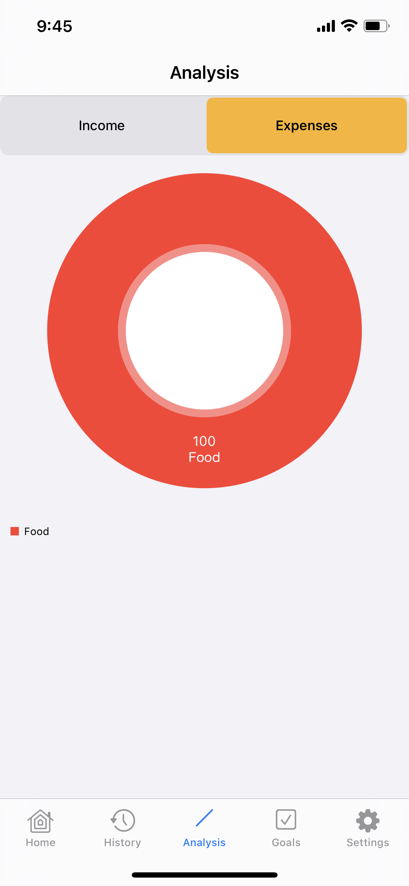
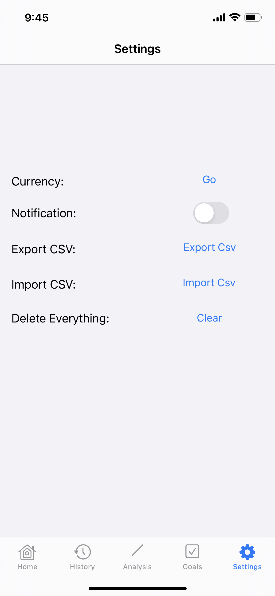

#  MoneySmart
<p align="center">
  <p>
      MoneySmart bring finance calculation from income, expense of future spending all to one place. Being organised is what this app is for. Easily add new items or delete with simple clicks and swipes. Calculate your expenses and show you statistic based on your monthly spending and earning. Travelling overseas? No problem, MoneySmart enables you to see the currency exchange rate simply by swiping your phone. Able to access anytime and easily data transfer from phone to phone.      <p>
      Features:
      <br>
        <b>#1.</b> Create different transaction types, incomes and expenses, to keep track of total balance      <br>
      <b>#2.</b> View History page to look through all previous transactions, filter using search function
      <br>
      <b>#3.</b> Edit or delete each transaction js by clicking it or swiping left
      <br>
      <b>#4.</b> View analysis page to see a pie chart for income/expenses
      <br>
      <b>#5.</b> Set financial goals for yourself to motivate yourself to save money
      <br>
      <b>#6.</b> Currency converter, notifications, importing, exporting and clear data
  </p>
</p>


## Demo Video
[](https://youtu.be/4b8RXVa5Qx0)

## Screenshots
<p align="row">

  
</p>
<p align="row">

  
</p>
<p align="row">

  
</p>
<p align="row">

</p>

## Requirements

- iOS 9.0+
- Xcode 14

## Installation

#### Git clone

```bash
git clone https://github.com/Derekqua/MoneySmart.git
cd countdown
```

#### CocoaPods
Install the pod libraries using [CocoaPods](http://cocoapods.org/):

```ruby
pod install
```

#### Usage

```bash
open MoneySmart.xcworkspace
```

## Credits

<table>
  <tr>
    <td align="center"><a href="https://github.com/Derekqua"><br /><sub><b>Derek Qua</b></sub></a><br />
    </td>
        <td align="center"><a href="https://github.com/Mahzhenyi"><br /><sub><b>Zhen Yi</b></sub></a><br />
    </td>
  </tr>
</table>

## Contribute

We would love you for the contribution to **MoneySmart**, any issue or pull request is welcomed.

